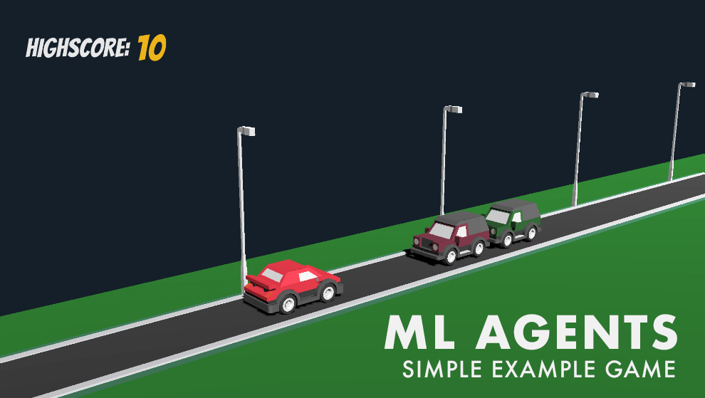

# Ultimate Walkthrough Example for ML-Agents 1.0+ in Unity3D
## Tutorial, how to use this repo
Hey! This is a complete walkthrough of building an A.I. with Unity’s ML-Agents. Make sure to clone this repo first to follow along! Having Unity3D and the ML-Agents Python package installed is a prerequiste. 

When first starting the, it’s just a human-controlled game, no machine learning involved, YET! By pressing the space key, you can let the car jump to dodge the incoming vehicles. We will train an A.I. via Machine Learning to do the same thing, hopefully, better than we — or at least I — can.



# Step 1: Transforming our player into an Agent

This is a simple game on purpose, we can always increase the complexity later. But starting simple decreases the potential amount of bugs. I always try to start so simply that it’s almost boring.


If you open up the main scene you can see a *Spawner* object located inside the *Environment*. Here you can determine the enemy cars being spawned and the interval they are being spawned with. But we can just leave it as it is. Next, inside our *Spawner*, our *Player* is located with a simple script called *Jumper* that is responsible for, well jumping.

The *Jumper.cs* script is really the only script we are concerned with, because this is what our A.I. will control. The main protagonists in our ML-Agents world are, as the name implies — **agents** — so let’s transform our jumper into one. Instead of inheriting from *MonoBehaviour*, it should inherit from *Agent*.

`public class Jumper : Agent`

Ta-da 🧙‍♂️, it is now an agent. Next, we add a *Behaviour Parameters*  **s**cript to our player because, without it, our agent is brainless. Let’s name it something useful like “Jumper”.

Now for the hard part, we have to think about the observations our agent needs to collect — meaning what information does it require and what actions can it take. Let’s start with the simple one first, actions.


Our Agent can **jump** and it can do **nothing**. That’s it. So we have two options, which means we have a *Discrete Action Space* with a size of 2 and just a single branch.


Multiple branches are useful if we would want to combine movement and jumping for example: Then we could use one branch for movement and one for jumping. A single branch would only allow movement or jumping but not both at the same time. Check out the example if you want to learn more about that. In our case, a single branch will do.

Next, the observations. Here, there is no right or wrong answer. Just try to think about a few possible ways an agent could observe the environment, how much data they each require and how much filtering an agent has to do, to infer useful information. Really, pause reading now and think about it …

… My idea is to start very simply, and I think our agent really only needs the distance to the next car, in order to time the jump right.


So I will go with a *raycast*, which you can imagine like a laser beam shot out from the agent until it hits something. It can register if something was hit, what was hit, and how far the thing hit is away. As this is a very common way of observing, Unity has conveniently prepared a simple script we can use for that, **nice 👌**.


Let’s add the *RayPerceptionSensor3D* component to our Player. We can already see a preview of the rays being shot in the scene view. First, we have to add the tags that are to be detected. In our case, the enemies spawned have the **Mover** tag, so let’s add that. Next, *Rays Per Direction* describes the number of rays to the left and right of center. As we only require a single, center ray, we can set this value to 0. The next relevant value is the *Ray Length*. In our case it should at least go to the end of the road, to be safe let’s use 50 here. To make sure the rays are not hitting the ground, let’s give them a vertical offset of .5 at the start and end.

That’s it. My advice, just play around with the slider and see what happens to learn more. Raycast are really powerful and the most common way of observing the environment besides visual information.

If we start the game now, we can see the ray being colored red if a car is in front, great. It’s working. The great thing about this Sensor is that it automatically adds itself to the observations, so no additional code is required and we can set the observation size to 0 because it is handled for us. *Isn’t this framework wonderful?*

# Step 2: Adding Logic to our Agent

Okay, now let’s jump into the *Jumper.cs* script. There are a few essential methods in the agent class. Let’s add them to our agent. *Initialize*(), *OnActionRecieved*(), and *OnEpisodeBegin*(). This time, we actually don’t need *CollectObservations()*, because we are using just the sensor. But we should add the *Heuristic*() method because this is where the human input can be handled.

**Always test your agents by playing them manually first**, you can find bugs easier and faster this way.

```csharp
public override void Initialize(){...}
public override void OnActionReceived(float[] vectorAction){...}
public override void OnEpisodeBegin(){...}
public override void Heuristic(float[] actionsOut){...}
```

First, let’s move everything from *Awake*() into *Initialize*(). Easy. Just delete the *Awake*() method, we don’t need it anymore.


```csharp
public override void Initialize()  
{  
 rBody = GetComponent<Rigidbody>();  
 startingPosition = transform.position;  
}
```

Now we have to handle the actions. The *OnActionReceived*() method has a float array parameter. As we only have a single branch, only the first element is interesting for us. The value of this will either be 0 or 1, so again very simple. Let’s determine that 0 is doing nothing and a 1 is for jumping. The great thing about coding nothing is that we have to code nothing, meaning we only have to check for the case of 1. Just to be safe, I will floor the float to an int before equality checking. **Bam**, this is our action function:

```csharp
public override void OnActionReceived(float[] vectorAction)  
{  
 if (Mathf.FloorToInt(vectorAction[0]) == 1)  
  Jump();  
}
```

Now, instead of checking the input in the *Update*(), we will check it inside the *Heuristic*() function. Just move everything from the *Update*() into the *Heuristic*() for now and delete the *Update*(). As the *Academy*, which is calling this function is running in Unity’s fixed update loop, input checking can be a bit buggy if we try to use *KeyDown* or *MouseDown*, so either use *GetKey*() or *GetAxis*() to be sure no inputs get lost.

Now instead of calling the *Jump*() function, we have to modify the a*ctionsOut[]* because the action handling is managed by the *OnActionsRecieved()* function. Whatever we put into a*ctionsOut[]* is received by the *OnActionsRecieved()* method. First, we set the a*ctionsOut[0]* to Zero and if a key is pressed to 1.

```csharp
public override void Heuristic(float[] actionsOut)  
{  
   actionsOut[0] = 0;

  if (Input.GetKey(jumpKey))
    actionsOut[0] = 1;  
}
```

Now if we start the game… we can see... that nothing happens 😢.

This is because no decisions are requested right now. One way to change that would be to add a **Decision Requester** component to our player. It is linked to the academy and requests a decision on every nth Academy step. If the value is set 5 like it is by default, every 5th steps. If we would add this component and set it to 1 it would work. But I won’t use it.

Why? Because we can **optimize** it. While the Car is in the air, there is nothing to do because jumping is only allowed while on the road. To simplify it, let’s not even request a decision while the car is in the air. Imagine the brain being turned off for that time frame. Let’s add the *FixedUpdate*() method and *Request a Decision* if the *jumpIsReady*.

```csharp
private void FixedUpdate()  
{  
  if(jumpIsReady)  
    RequestDecision();  
}
```

Again, this is only one way of doing it. If you think of something else, try it.

We are almost ready to train, but the most important part is still missing. **rewards ⭐️**! Everybody loves rewards, especially A.Is. This part is easy again but **if you do it badly, you can really mess everything up**. Don’t worry though 😄. Most often, a simple and straightforward way just works. A basic rule of thumb is a -1 punishment when losing and a +1 reward when winning. As this is a high score game, there is no winning, so I just decided that I add 0.1 reward for each car.

This is in no way the best-designed reward system, but it works. If you are unsure — testing with multiple runs and a predefined number of steps and then comparing the results is probably your best bet. But more on testing later.

In the script inside the *OnTriggerEnter*() Method, we will call the *AddReward*() Method.

```csharp
private void OnTriggerEnter(Collider collidedObj)  
{  
 if (collidedObj.gameObject.CompareTag("score"))  
 {  
   AddReward(0.1f); //New  
   score++;  
   ScoreCollector.Instance.AddScore(score);  
 }  
}
```

The scoring in this game works like this: Each car has a hidden cube behind itself that triggers the *OnTriggerEnter()* method on collision.


Next in the *OnCollisionEnter*() method, we find the case where the player is hit by the incoming traffic. First, we replace the *Reset*() Method with the *EndEpisode*() Method. Next, we will add a negative reward here.

```csharp
private void OnCollisionEnter(Collision collidedObj)  
{  
   if (collidedObj.gameObject.CompareTag("Street"))  
    jumpIsReady = true;

  else if (collidedObj.gameObject.CompareTag("Mover") || collidedObj.gameObject.CompareTag("DoubleMover"))
  {
    AddReward(-1.0f);
    EndEpisode();
  }  
}
```

# Step 3: Training the Agent

We can finally start training now! To optimize training we should add multiple agents and build a standalone application, **but** I always test in the editor with a single agent first to spot any bugs. Right now, this game is hopefully bug-free but as you can imagine this wasn't always the case.

I assume Python with ML-Agents is already installed on your system if not, check out the installation guide .

We will just open the terminal and *cd* into the repository and then into the *TrainerConfig* folder. Now we start the training by putting in:

`mlagents-learn trainer_config.yaml --run-id="JumperAI_1"`

You can change the *run-id* to whatever you like best. The second parameter refers to the *trainer_config* file, which located inside the repository. **This exact command only works if you are inside the *TrainerConfig* folder inside the downloaded repository**!

If you see the Unity logo, everything went well. Now we switch into the editor, press play, and let the A.I. train for a good 10 Minutes. Now is the time to watch the training process and see if you can spot any obvious bugs.

By putting in

`tensorboard --logdir=summaries`

into another terminal tab, we can inspect it further. The graph on the left reveals the reward accumulated over time.

*Around 10 minutes later.*


In my case, around the 8-minute mark, the first real improvements started happening, and then it got better very quickly. This is good, it confirms that our environment is working.

The next step is to train with multiple agents to speed up and stabilize the training. In our case, this is as easy as copying the environment gameobject multiple times.


Again, we first press play and test if everything still seems fine. If it does, great. Now, let’s start a second training process, again in the editor to make sure, multiple agents work as expected. We will just use the same command but change the ID so we can compare the runs.

`mlagents-learn trainer_config.yaml --run-id="JumperAI_2"`

*10 minutes later.*


In my case, it worked very well. We can see our second graph is way larger. This is because we processed many more steps in the same amount of time due to the number of agents we have. Again this is why we start simple — we were able to validate that our environment was working in a few minutes of training time, instead of hours.

Now, for proper and complete training, we can build the application. Execute the *mlagents-learn* command again, this time referencing our build file, setting the time scale to 10 meaning 10 times the speed, which works well on my system, the graphics quality level to 0 and the window width and height to 512 or whatever you prefer.

`mlagents-learn trainer_config.yaml --run-id=JumperAI_3 --env=../Build/build.app --time-scale=10 --quality-level=0 --width=512 --height=512`

*60 minutes later.*


If we are happy with the result, we press control+c, then a model gets generated. We can drag this .*nn* file into our Project, select all the agents by searching *Player* in the hierarchy, and put it into the *Model* slot. If we press play now we can see it executing our model. Be **proud, you have trained an A.I**, how many people have done that?

If you got lost somewhere on the way you can always check out the , there you can find the project with a trained model and the finished scripts.

I would encourage you to play around with this project and create your own twist.
